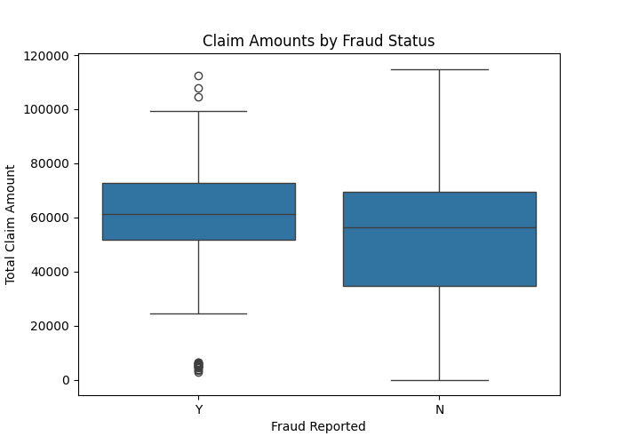

# Insurance Fraud Detection — Data Analysis Project

This project performs exploratory data analysis (EDA) on an auto insurance dataset to uncover fraud patterns and understand key features.

## 🔍 Objective
To identify behavioral and financial patterns in insurance claims that differentiate fraudulent and non-fraudulent claims.

---

## 📊 Key Insights

### 📌 1. Claim Amount Distribution

Box plot shows that fraudulent claims tend to have higher and more varied claim amounts.

---

### 📌 2. Feature Correlations

Heatmap reveals how claim components (injury, vehicle, property) correlate with total claim amount and each other.

---

## 🛠 Tools Used
- Python (Pandas, Seaborn, Matplotlib)
- PyCharm
- Git + GitHub

---

## 🚀 Next Steps
- Feature engineering
- Fraud prediction modeling (classification)
- Interactive dashboard (Streamlit / Power BI)

---

## 📁 Dataset
Auto Insurance Claims from [Kaggle](https://www.kaggle.com/datasets/buntyshah/auto-insurance-claims-data)
